**Students:** John Gardner  
**Date:** 25/11/2024  
**Cohort:** CI - Full Stack Software Developer: Skills Bootcamp  
**Project:** Travel Blog: HTML, CSS, Bootstrap, JS, Python, Django

---
# **EcoTrails**

**EcoTrails** is an eco-conscious travel blog designed to inform readers about sustainable and environmentally friendly travel experiences around the world. The mission is to encourage exploration while promoting practices that preserve our planet.

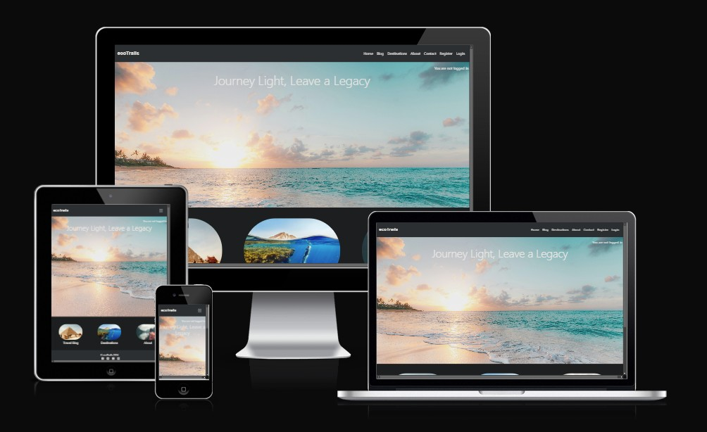

 
 

## **URL's**

  - **Home Page** https://ecotrails-54f65842ae68.herokuapp.com
  - **Admin Page** https://ecotrails-54f65842ae68.herokuapp.com/admin/
  - **Github repository** https://github.com/JohnWGardner/ecotrails
  - **Github project** https://github.com/users/JohnWGardner/projects/8

 
 

# Understand the Purpose:

* A platform for travel enthusiasts to share their experiences, discover new destinations and engage with like-minded travelers. The primary goals of this project are:

  * To create a travel blog with informative and engaging content.
  * To facilitate user interaction through comments and recommendations.
  * To provide a user-friendly interface for browsing and contributing content.

    
    

# Project Management Approach

### Agile Methodology
I used an agile methodology. breaking down the project into smaller sprints, giving flexibility as the project progressed.

### GitHub Project Management
As shown below, I used GitHub Projects to track tasks and their progress. Using MoSCoW, Kanban boards and sprints, to prioritise and deliver work.
  

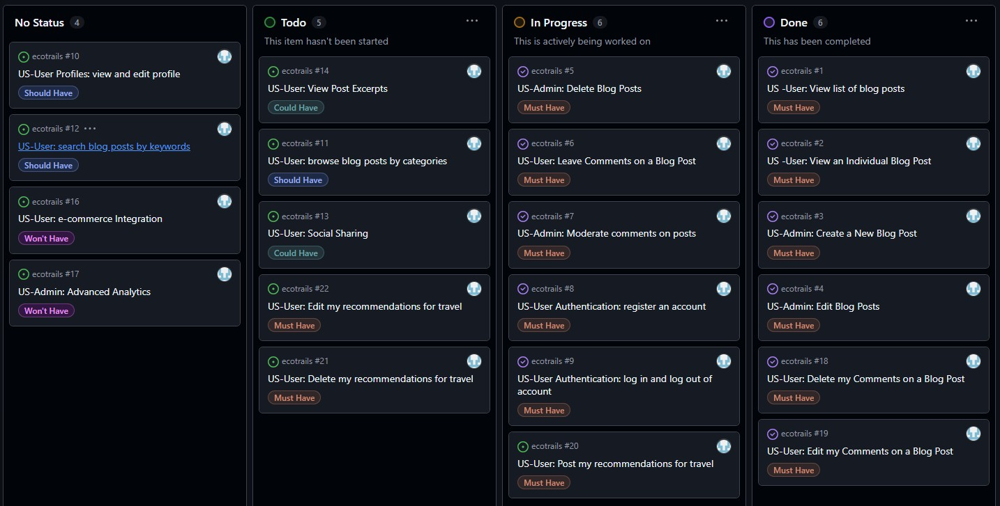
 

### MoSCoW Prioritisation

* **Must-Have:** Core functions for the site basic operation, such as user authentication, blog post management, and travel recommendation submission.
* **Should-Have:** Features that enhance user experience, such as continent-based travel recommendation categorisation.
* **Could-Have:** Additional features to improve the site but are not critical, such as view excerpts
* **Won't-Have:** Features that are not prioritised for  development, such as e-commerce integration.

### Sprint Planning

* **Sprint 1: Core Functionality**
  * User registration and authentication
  * Blog post creation, editing, and deletion
  * User comment submission and moderation
  * Travel recommendation submission and moderation
* **Sprint 2: User Experience and Features**
  * User interface and user experience improvements  
  * Continent-based travel recommendations
* **Sprint 3: Deployment and Testing**
  * Final deployment to production environment
  * Testing for quality and performance
  * Bug fixing

  
  

## Platform Features

* **Home Page**
  * Welcomes visitors and provides a brief overview of the blog's content.
  * Features a carousel of popular blog posts.
  * Highlights the latest blog posts and travel recommendations.

  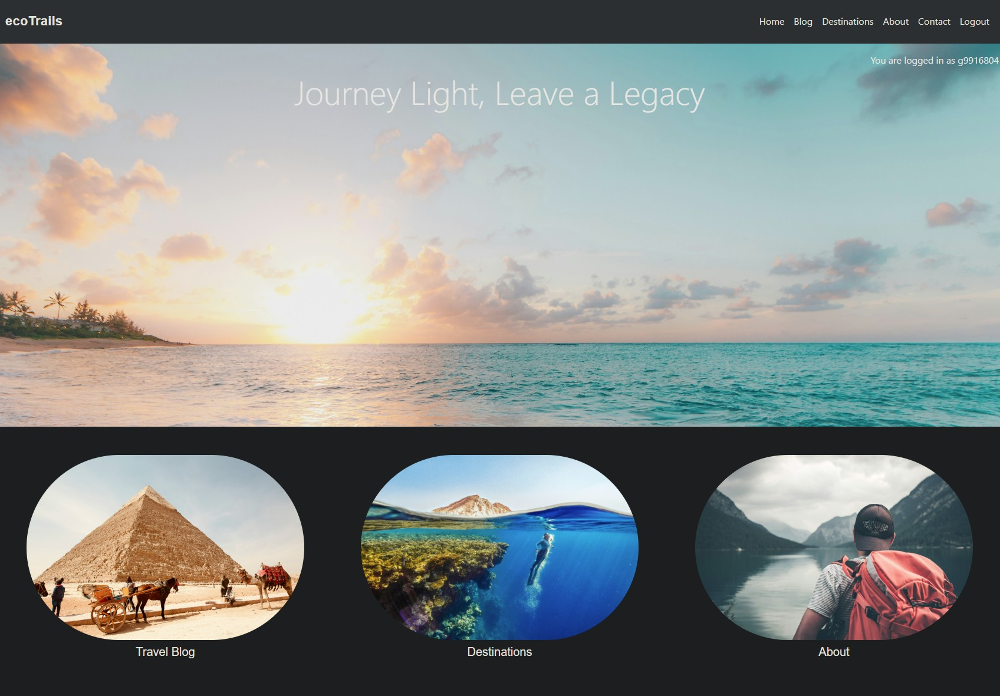

* **Blog Page**
  * Displays a list of blog posts, categorized by topic or region.
  * Allows users to view individual blog posts in detail.
  * Enables users to leave comments on blog posts.

  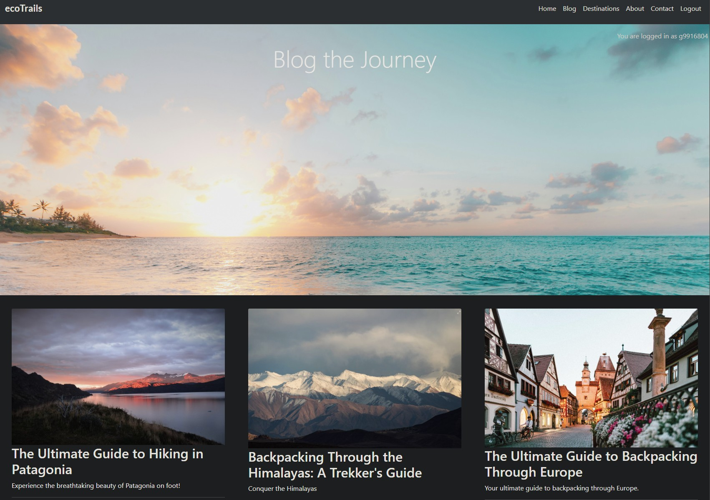

* **Travel Recommendation Page**
  * Displays a list of travel recommendations submitted by admin.
  * Allows users to view recommendations by continent.
  * Provides a form for users to submit their own travel recommendations.

  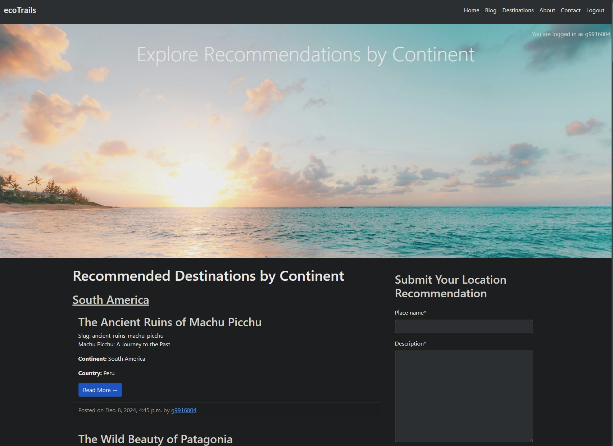

* **About Page**
  * Provides information about the site owner.

  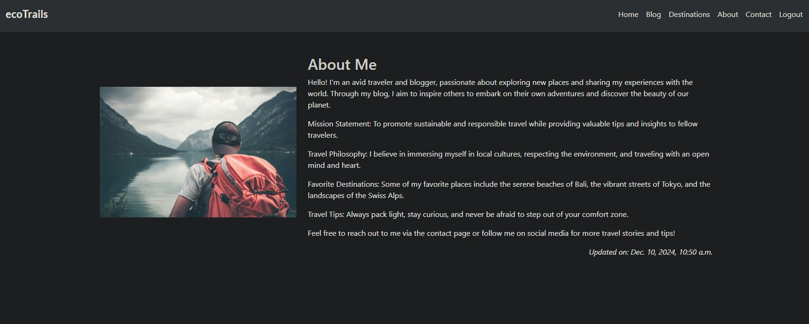

* **Contact Page**
  * Allows users to send messages to the the site owner.

  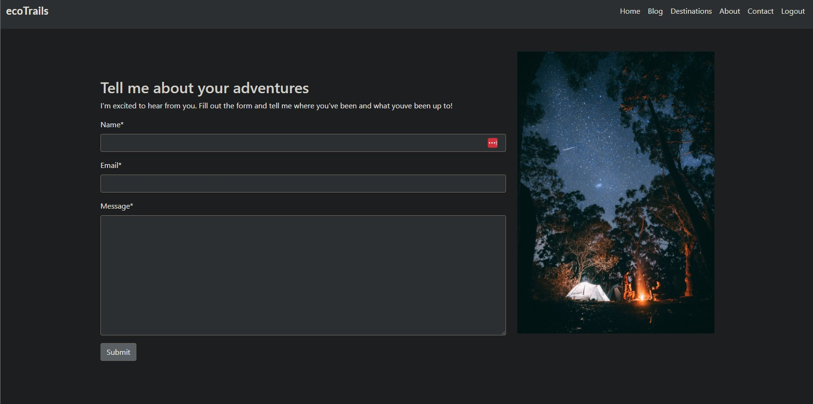

## User Authentication and Notifications

* **User Accounts**
  * Create an account

  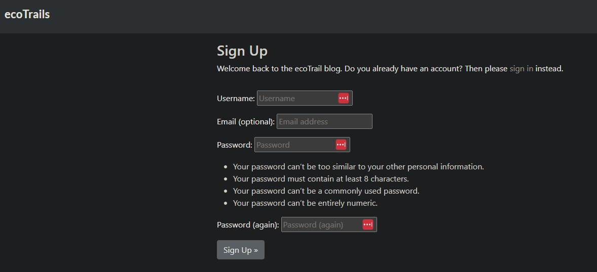

  * Sign in

  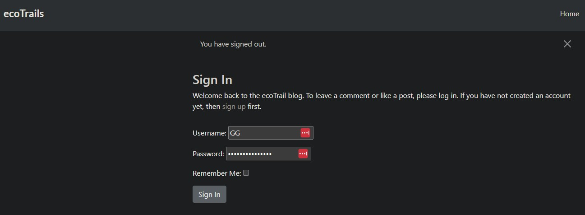

* **Notifications**
  * Receive notifications for:
    * Logged in

  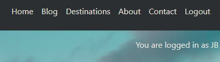

    * Logged out

  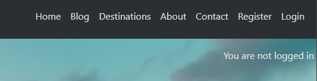

    * CRUD Travel recommendation posts

  

  

  

    * CRUD blog comment posts

  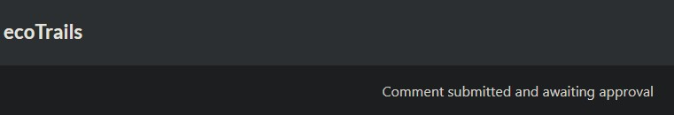

  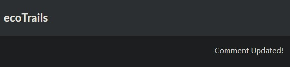

  

---

## Target Audience

* Travel enthusiasts
* Travel bloggers
* Travelers seeking advice

## User Stories

| User Story | MoSCoW | Acceptance Criteria |
|---|---|---|
| **Admin Features** | | |
| Admin: Create a New Blog Post | Must Have | The admin should be able to create a new blog post with a title, content, image, and category. |
| Admin: Edit Blog Posts | Must Have | The admin should be able to edit the title, content, image, and category of an existing blog post. |
| Admin: Delete Blog Posts | Must Have | The admin should be able to delete a blog post and its associated comments. |
| Admin: Moderate user comments on posts | Must Have | The admin should be able to approve, reject, or edit user comments. |
| Admin: Moderate user recommendations for travel | Must Have | The admin should be able to approve, reject, or edit user recommendations. |
| **User Features** | | |
| User: View list of blog posts | Must Have | The user should be able to view a list of blog posts, sorted by date or category. |
| User: View an Individual Blog Post | Must Have | The user should be able to view the full content of a blog post, including images and comments. |
| User Authentication: register an account | Must Have | The user should be able to create an account with a username and password. |
| User Authentication: log in and log out of account | Must Have | The user should be able to log in and log out of their account securely. |
| User: Post Comments on a Blog Post | Must Have | The user should be able to post comments on blog posts, subject to moderation. |
| User: Delete my Comments on a Blog Post | Must Have | The user should be able to delete their own comments. |
| User: Edit my Comments on a Blog Post | Must Have | The user should be able to edit their own comments within a certain timeframe. |
| User: Post my recommendations for travel | Must Have | The user should be able to submit travel recommendations, including destination, activities, and tips. |
| User: Delete my recommendations for travel | Must Have | The user should be able to delete their own travel recommendations within a certain timeframe. |
| User: Edit my recommendations for travel | Must Have | The user should be able to edit their own travel recommendations within a certain timeframe. |
| User: View Post Excerpts | Could Have | A concise excerpt should be displayed. |
| User: browse travel recommendations by categories (continents) | Should Have | Travel recommendations should be categorized by continent to facilitate browsing. |
| User: e-commerce Integration | Won't Have | Not applicable. |
| Admin: Advanced Analytics | Won't Have | Not applicable. |

---

# Technologies Used

- **HTML5**: Used to create the templates that render the dynamic content generated by Django's views.
- **CSS3**: Used to style templates, creating the visual layout and design of the application.
- **Bootstrap**: Used to accelerate development creating responsive designs that adapt to different screen sizes.
- **Python**: Used to build Django applications. handleing server-side logic, database interactions, and template rendering.
- **JavaScript**: Used to add dynamic behavior to web pages
- **GitHub**: Used to deploy the static files generated by Django.
- **Heroku**:  Used to deploy the Django app managing the infrastructure
- **Balsamiq**: Used for UX wireframes and design

---

# Design Choices

## ERD design:

The Entity-Relationship Diagram for ecoTrails is designed to model the data of our travel blog site. This initally helped me understand the data and relationships between fields like Users, BlogPosts, Destinations, and Recommendations. 

## Color Scheme

- Bright sunny color scheme used to enhance visual appeal.

## Fonts

- Standard fonts for readability and consistent design.
- Slightly larger, bold fonts for key information to improve visibility.

## Wireframes

- Wireframes were created to design the Travel Blog layout:  

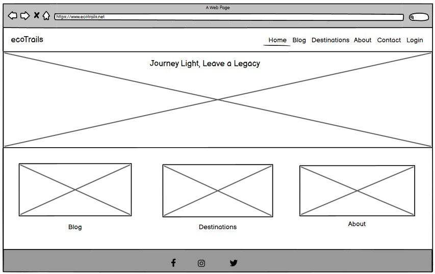

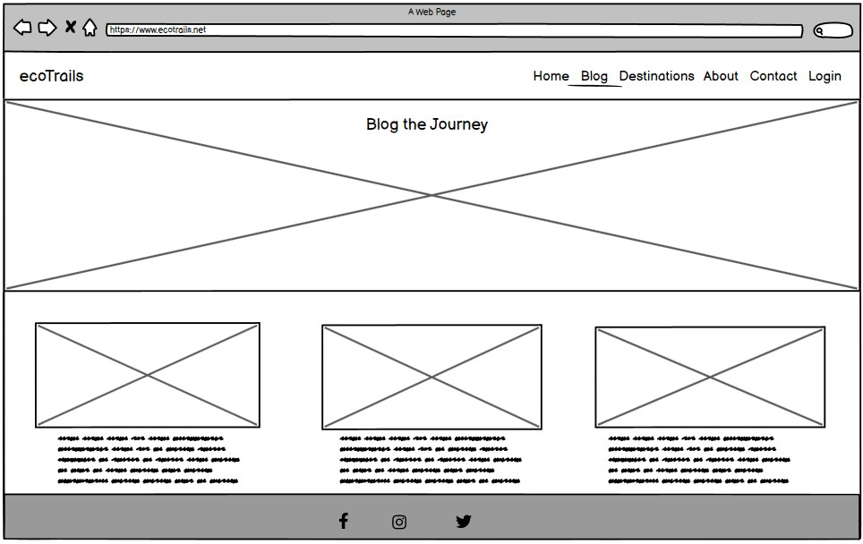

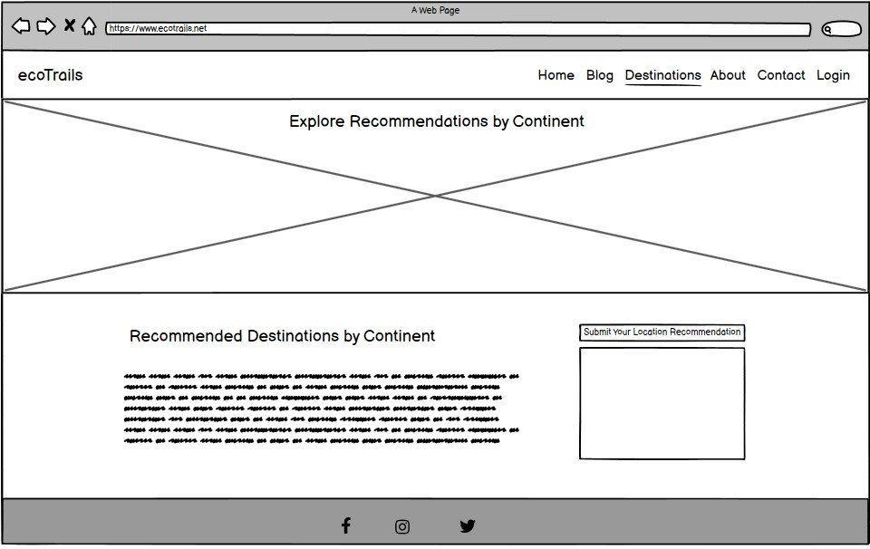

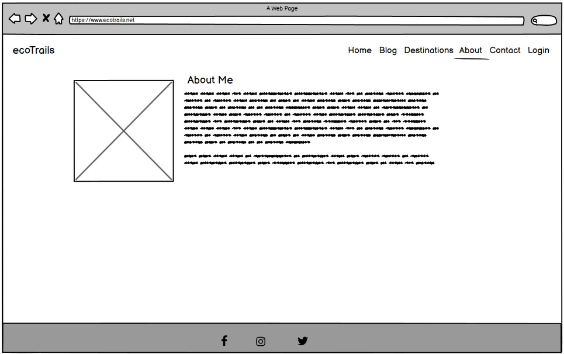

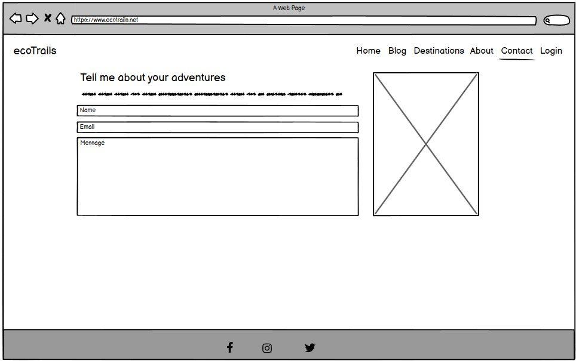

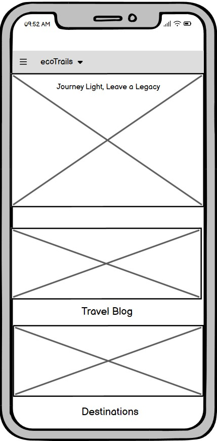

---

# Testing

The code has been tested and successfully validated though:

### HTML Validation - Status=Passed

- Initial HTML validation was done using the W3C Markup Validation Service.

 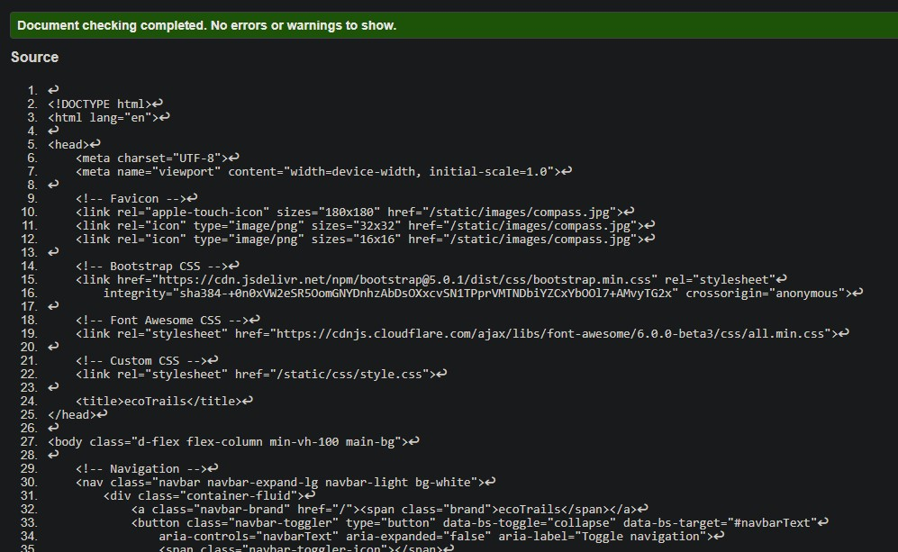

### CSS Validation - Status=Passed

- CSS validation was performed using W3C's CSS Validator.

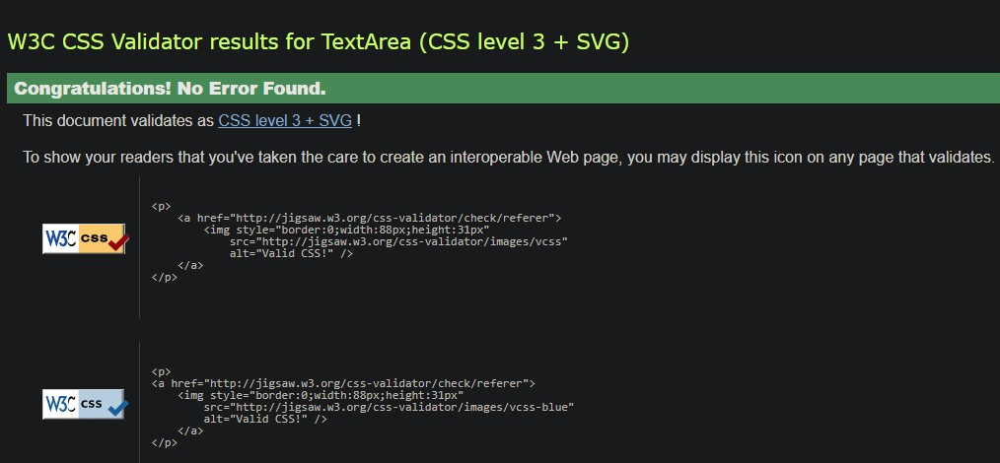

### Python Linter - Status=Passed, 
- I needed to remove comments to pass, as they are lengthy and exceeded 79 chars. These have been put back in as useful to my learning

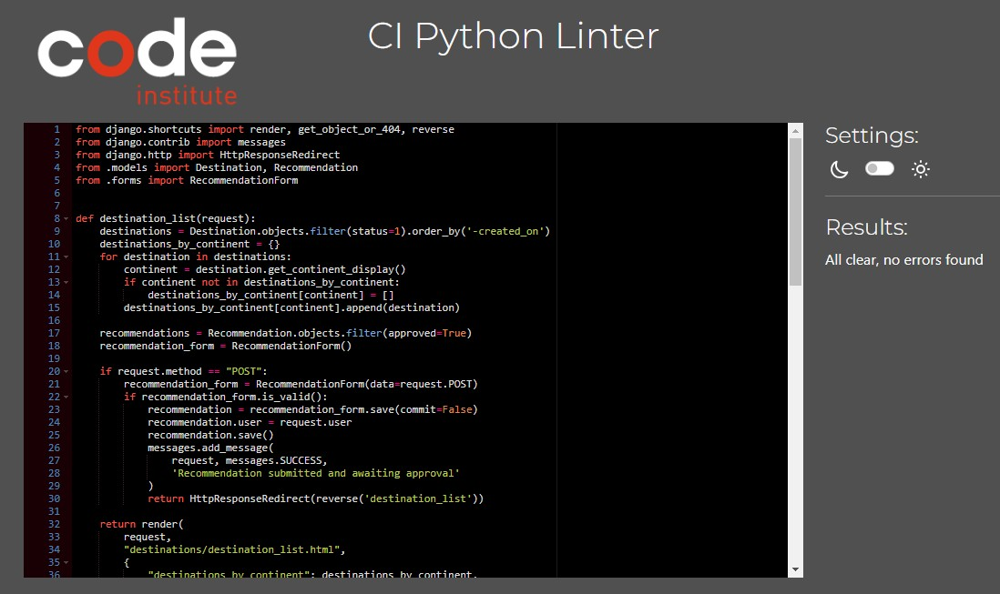

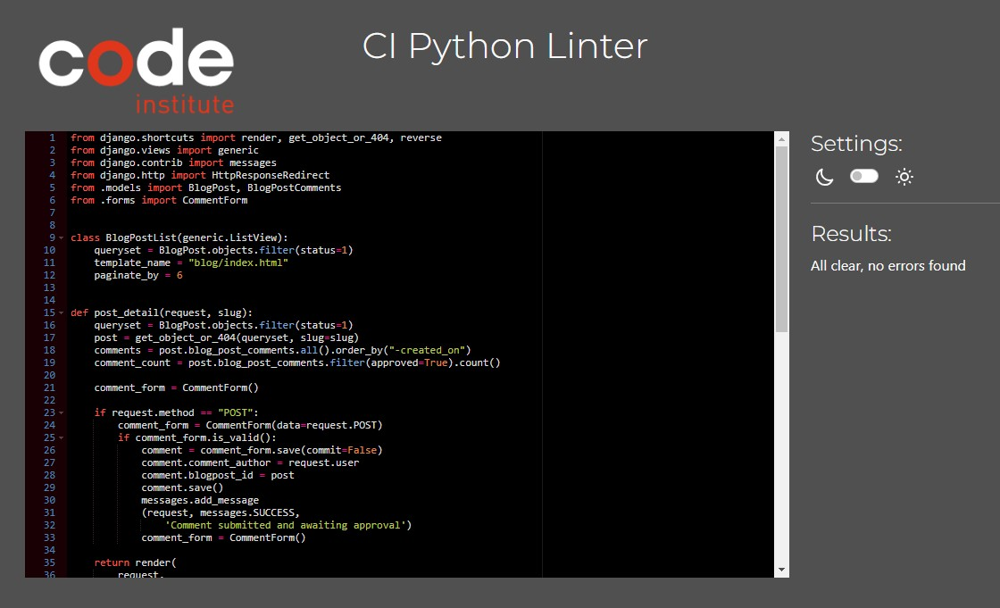

## Manual Testing against User Story acceptance:

| User Story | MoSCoW | Status | CI Criteria | Validation Test |
|---|---|---|---|---|
| Admin: Create a New Blog Post | Must Have | Done | TRUE | TRUE |
| Admin: Edit Blog Posts | Must Have | Done | TRUE | TRUE |
| Admin: Delete Blog Posts | Must Have | Done | TRUE | TRUE |
| Admin: Moderate user comments on posts | Must Have | Done | TRUE | TRUE |
| Admin: Moderate user recommendations for travel | Must Have | Done | TRUE | TRUE |
| User: View list of blog posts | Must Have | Done | TRUE | TRUE |
| User: View an Individual Blog Post | Must Have | Done | TRUE | TRUE |
| User Authentication: register an account | Must Have | Done | TRUE | TRUE |
| User Authentication: log in and log out of account | Must Have | Done | TRUE | TRUE |
| User: Post Comments on a Blog Post | Must Have | Done | TRUE | TRUE |
| User: Delete my Comments on a Blog Post | Must Have | Done | TRUE | TRUE |
| User: Edit my Comments on a Blog Post | Must Have | Done | TRUE | TRUE |
| User: Post my recommendations for travel | Must Have | Done | TRUE | TRUE |
| User: Delete my recommendations for travel | Must Have | Done | TRUE | TRUE |
| User: Edit my recommendations for travel | Must Have | Done | TRUE | TRUE |
| User: View Post Excerpts | Could Have | Done | FALSE | TRUE |
| User: Social Sharing | Could Have | Done | FALSE | TRUE |
| User: browse travel recommendations by categories (continents) | Should Have | Done | FALSE | TRUE |
| User: search blog posts by keywords | Could Have | Not Done | FALSE | FALSE |
| User: e-commerce Integration | Won't Have | Not Done | FALSE | FALSE |
| Admin: Advanced Analytics | Won't Have | Not Done | FALSE | FALSE |

## Criteria met:

- At least one original custom model with associated functionalities, markedly different from those present in the Hello, Django! or Codestar Blog walkthrough projects if they have been used in your project.	Status=Done: (ecotrails/destinations/models.py) and (ecotrails/about/models.py)
	
- At least one form on the front end, which provides either admin or regular users with CRUD functionality without having to access the admin panel. Status=Done: (ecotrails/destinations/forms.py) and (ecotrails/blog/forms.py)
	
- At least one UI element on the front end, which allows either admin or regular users to delete records in the database without having to access the admin panel.	Status=Done: (ecotrails/destinations/templates/destinations/destination_list.html) and (ecotrails/blog/templates/blog/post_detail.html)
	
- Evidence of agile methodologies followed during the development of your project in the GitHub repository.	Status=Done: as discussed/shown above in: Project Goals
	
- DEBUG mode set to False.	Status=Done: DEBUG = False
	
- Working functionality for users to register and log in and out of the application without issues.	Status=Done: as discussed/shown above in: User Authentication and Notifications
	
- Detailed testing write ups, beyond results of validation tools.	Status=Done: as discussed/shown above in: Testing

## Accessibility testing

- Google Lighthouse audit reports an accessibility score of 87%, ensuring users with disabilities can access the site effectively.

## Browser and Device Testing

- Tested on multiple devices and browsers for responsiveness:
  - iPhone
  - Desktop
  - Chrome Developer Tools (simulating various devices)
  - Browsers: Chrome, Edge, and Safari
- Site functioned as expected across all tested platforms.

---

# Bugs

- DB error,  When implementing the edit and delete functionalty for user initiated travel recommendations. I added an additional field into the recommendations model.py to be pushed to the database. When tried to migrate this field sql complained that these field would need a default value. I added a default value and it corrupted the database. note to self: learnt I could go back to a previous migration and this fixed the problem.

- Editing and deleting Travel Recomendations: Getting the functionality correct for editing and deleting travel recommendations too many bugs to list as it was not as easy as I originally thought as I couldn't refer to the recommendation via slug as other lessons had shown me. I needed to target the element ID. I remembered that I could make id(pk) visible in the admin panel. Then started the logic of understanding how to target id to the edit recommendations, this was done through recommendations.js, HTML and view.py

- The use of dark reader caused issues when testing on all devices, had to redo all CSS at last min, i'm hopefull i've caught all restyling issues

# Deployment

**Deploying to Heroku**

The steps I took to deploy Django project to Heroku:

1. **Create a New App:**
   - Log in to your Heroku account and click "New App."
   - Choose a unique name for app.
   - Select  preferred region.
   - Click "Create App."

2. **Connect to GitHub:**
   - In the "Deploy" tab, select "GitHub."
   - Connect GitHub account and select the project repository.

3. **Configure Deployment:**
   - Choose manual to reserve depolyments and possible credit issues.
   - Ensure main branch is selected for deployment.

4. **Set Up Config Vars:**
   - In the "Settings" tab, click "Reveal Config Vars."
   - Add necessary environment variables, such as database credentials and API keys.

5. **Select Buildpacks:**
   - In the "Buildpacks" tab, add Node.js and Python buildpacks.

6. **Deploy:**
   - Click "Deploy Branch."
   - Once deployed, you can access your live app using the provided URL or pressing the 'open app' button.
---

# Future Enhancements:
- More emphasis on design for leaving travel recommendations, as it's not as user-friendly as I would like on a mobile device.
- Editing user-generated travel recommendations works after admin approval, but needs more finessing to allow for additions before approval, TBH I ran out of time to fix this.

---

# Credits

- **Bootstrap**: For layout, components, and responsive design.
- **Code Institute**: For project templates and guidance.
- **Font Awesome**: For fonts.
- **Favicon**: For favicon image.
- **Freepik**: For hero image.

# Thanks

- My thanks to Alex, Kevin and John in CI for there support and guidance thoughout
---
