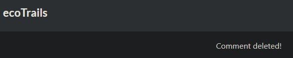
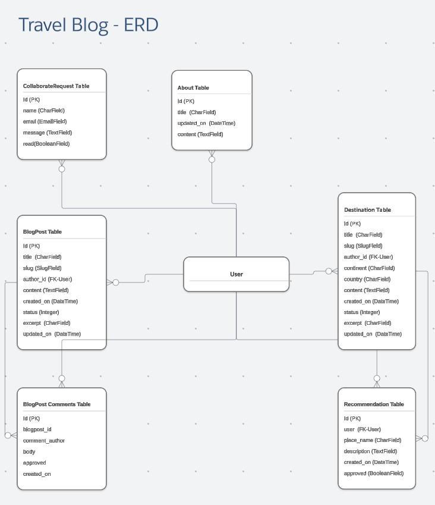

**Students:** John Gardner  
**Date:** 25/11/2024  
**Cohort:** WECA - Full Stack Software Developer: Skills Bootcamp  
**Project:** Travel Blog: HTML, CSS, Bootstrap, JS, Python, Django

---

# 1. Project Goals

## 2. Understand the Purpose:

* A platform for travel enthusiasts to share their experiences, discover new destinations and engage with like-minded travelers. The primary goals of this project are:

  * To create a comprehensive travel blog with informative and engaging content.
  * To facilitate user interaction through comments and recommendations.
  * To provide a user-friendly interface for browsing and contributing content.
  * To establish a strong online presence for the travel blog.

## 3. Developer Key Goals:

## 4. Platform Features

* **Home Page**
  * Welcomes visitors and provides a brief overview of the blog's content.
  * Features a carousel of popular blog posts.
  * Highlights the latest blog posts and travel recommendations.

  

* **Blog Page**
  * Displays a list of blog posts, categorized by topic or region.
  * Allows users to view individual blog posts in detail.
  * Enables users to leave comments on blog posts.

  

* **Travel Recommendation Page**
  * Displays a list of travel recommendations submitted by admin.
  * Allows users to view recommendations by continent.
  * Provides a form for users to submit their own travel recommendations.

  

* **About Page**
  * Provides information about the site owner.

  

* **Contact Page**
  * Allows users to send messages to the the site owner.

  

## User Authentication and Notifications

* **User Accounts**
  * Create an account

  

  * Sign in

  

* **Notifications**
  * Receive notifications for:
    * Logged in

  

    * Logged out

  

    * Travel recommendation posts

  

  

  

    * blog comment posts

  

  

  

---

## 5. Target Audience

* Travel enthusiasts
* Travel bloggers
* Travelers seeking advice

## 6. User Stories

| User Story | MoSCoW | Acceptance Criteria |
|---|---|---|
| **Admin Features** | | |
| Admin: Create a New Blog Post | Must Have | The admin should be able to create a new blog post with a title, content, image, and category. |
| Admin: Edit Blog Posts | Must Have | The admin should be able to edit the title, content, image, and category of an existing blog post. |
| Admin: Delete Blog Posts | Must Have | The admin should be able to delete a blog post and its associated comments. |
| Admin: Moderate user comments on posts | Must Have | The admin should be able to approve, reject, or edit user comments. |
| Admin: Moderate user recommendations for travel | Must Have | The admin should be able to approve, reject, or edit user recommendations. |
| **User Features** | | |
| User: View list of blog posts | Must Have | The user should be able to view a list of blog posts, sorted by date or category. |
| User: View an Individual Blog Post | Must Have | The user should be able to view the full content of a blog post, including images and comments. |
| User Authentication: register an account | Must Have | The user should be able to create an account with a username and password. |
| User Authentication: log in and log out of account | Must Have | The user should be able to log in and log out of their account securely. |
| User: Post Comments on a Blog Post | Must Have | The user should be able to post comments on blog posts, subject to moderation. |
| User: Delete my Comments on a Blog Post | Must Have | The user should be able to delete their own comments. |
| User: Edit my Comments on a Blog Post | Must Have | The user should be able to edit their own comments within a certain timeframe. |
| User: Post my recommendations for travel | Must Have | The user should be able to submit travel recommendations, including destination, activities, and tips. |
| User: Delete my recommendations for travel | Must Have | The user should be able to delete their own travel recommendations within a certain timeframe. |
| User: Edit my recommendations for travel | Must Have | The user should be able to edit their own travel recommendations within a certain timeframe. |
| User: View Post Excerpts | Could Have | A concise excerpt should be displayed. |
| User: browse travel recommendations by categories (continents) | Should Have | Travel recommendations should be categorized by continent to facilitate browsing. |
| User: e-commerce Integration | Won't Have | Not applicable. |
| Admin: Advanced Analytics | Won't Have | Not applicable. |

---

# 7. Technologies Used

- **HTML5**: Used to create the templates that render the dynamic content generated by Django's views.
- **CSS3**: Used to style templates, creating the visual layout and design of the application.
- **Bootstrap**: Used to accelerate development creating responsive designs that adapt to different screen sizes.
- **Python**: Used to build Django applications. handleing server-side logic, database interactions, and template rendering.
- **JavaScript**: Used to add dynamic behavior to web pages
- **GitHub Pages**: Used to deploy the static files generated by Django.
- **Heroku**:  Used to deploy the Django app managing the infrastructure

---

# 8. Design Choices

ERD design:

## Color Scheme

- bright sunny color scheme used to enhance visual appeal.

## Fonts

- Standard fonts for readability and consistent design.
- Slightly larger, bold fonts for key information to improve visibility.

## Wireframes

- Wireframes were created to design the Travel Blog layout:  

---

# 9. Testing

## HTML Validation

- Initial HTML validation was done using the W3C Markup Validation Service.

 

## CSS Validation

- CSS validation was performed using W3C's CSS Validator.

## Manual Testing against user story compliance:

| User Story | MoSCoW | Status | CI Criteria | Validation Test |
|---|---|---|---|---|
| Admin: Create a New Blog Post | Must Have | Done | TRUE | TRUE |
| Admin: Edit Blog Posts | Must Have | Done | TRUE | TRUE |
| Admin: Delete Blog Posts | Must Have | Done | TRUE | TRUE |
| Admin: Moderate user comments on posts | Must Have | Done | TRUE | TRUE |
| Admin: Moderate user recommendations for travel | Must Have | Done | TRUE | TRUE |
| User: View list of blog posts | Must Have | Done | TRUE | TRUE |
| User: View an Individual Blog Post | Must Have | Done | TRUE | TRUE |
| User Authentication: register an account | Must Have | Done | TRUE | TRUE |
| User Authentication: log in and log out of account | Must Have | Done | TRUE | TRUE |
| User: Post Comments on a Blog Post | Must Have | Done | TRUE | TRUE |
| User: Delete my Comments on a Blog Post | Must Have | Done | TRUE | TRUE |
| User: Edit my Comments on a Blog Post | Must Have | Done | TRUE | TRUE |
| User: Post my recommendations for travel | Must Have | Done | TRUE | TRUE |
| User: Delete my recommendations for travel | Must Have | Done | TRUE | TRUE |
| User: Edit my recommendations for travel | Must Have | Done | TRUE | TRUE |
| User: View Post Excerpts | Could Have | Done | FALSE | TRUE |
| User: Social Sharing | Could Have | Done | FALSE | TRUE |
| User: browse travel recommendations by categories (continents) | Should Have | Done | FALSE | TRUE |
| User: search blog posts by keywords | Could Have | Not Done | FALSE | FALSE |
| User: e-commerce Integration | Won't Have | Not Done | FALSE | FALSE |
| Admin: Advanced Analytics | Won't Have | Not Done | FALSE | FALSE |

## Criteria met:

- At least one original custom model with associated functionalities, markedly different from those present in the Hello, Django! or Codestar Blog walkthrough projects if they have been used in your project.	Status=Done: (ecotrails/destinations/models.py) and (ecotrails/about/models.py)
	
- At least one form on the front end, which provides either admin or regular users with CRUD functionality without having to access the admin panel. Status=Done: (ecotrails/destinations/forms.py) and (ecotrails/blog/forms.py)
	
- At least one UI element on the front end, which allows either admin or regular users to delete records in the database without having to access the admin panel.	Status=Done: (ecotrails/destinations/templates/destinations/destination_list.html) and (ecotrails/blog/templates/blog/post_detail.html)
	
- Evidence of agile methodologies followed during the development of your project in the GitHub repository.	Status=Done: ecotrails/static/images/README/Agile Planning.jpg
	
- DEBUG mode set to False.	Status=Done: DEBUG = False
	
- Working functionality for users to register and log in and out of the application without issues.	Status=Done: (django.contrib.auth.models import User)
	
- Detailed testing write ups, beyond results of validation tools.	Status=Done: inc testing against user story compliance

## Accessibility testing

- Google Lighthouse audit reports an accessibility score of 87%, ensuring users with disabilities can access the site effectively.

## Browser and Device Testing

- Tested on multiple devices and browsers for responsiveness:
  - iPhone
  - Desktop
  - Chrome Developer Tools (simulating various devices)
  - Browsers: Chrome, Edge, and Safari
- Site functioned as expected across all tested platforms.

---

# Bugs

# Deployment

The app was deployed using **GitHub Pages**:

1. In the GitHub repository, navigate to **Settings**.
2. Select **Pages** from the left-hand menu.
3. Choose the **Main Branch** as the source, then save.
4. The page will automatically be published.

- **Live App URL:** [ecotrails App](https://ecotrails-54f65842ae68.herokuapp.com/)

- Agile methodology was used, with early deployment to see every change live, aiding the development process.

---

# Future Enhancements:
- More emphasis on design for leaving travel recommendations, as it doesn't work as well as I would like on a mobile device.

---

# Credits

- **Bootstrap**: For layout, components, and responsive design.
- **Code Institute**: For project templates and guidance.
- **Font Awesome**: For fonts.
- **Favicon**: For favicon image.
- **Freepik**: For hero image.

---
